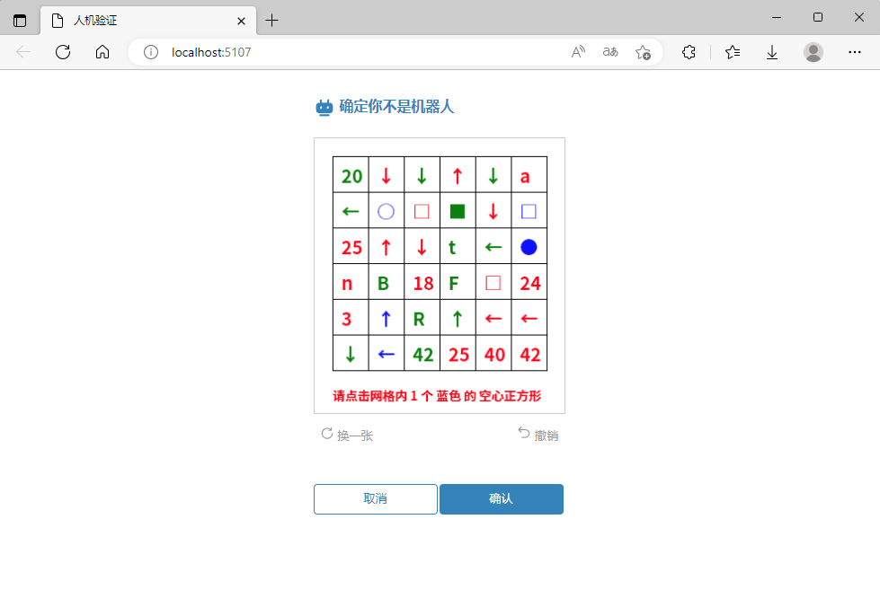
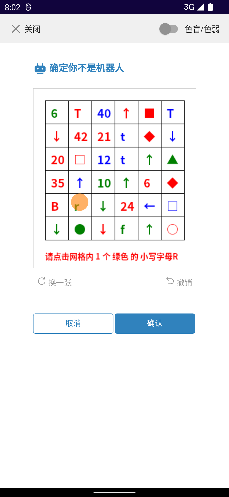
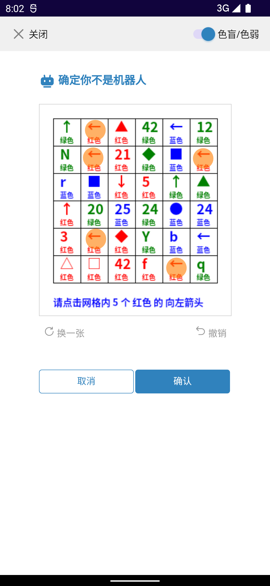

# ClickableCaptcha

ClickableCaptcha是一个使用**SkiaSharp**类库的可点击图形验证码，这个图形验证码会生成6*6网格的图像，用户根据底部的提示点击图片内正确的相应位置。

代码中包含以下结构：

+ screenshot

+ src

    + ClickableCaptcha

    + WebDemo

**screenshot**是实际运行效果截图保存文件夹；

**ClickableCaptcha**是主要核心类库文件；

**WebDemo**是一个演示项目，具体配置请参考*Program.cs*文件。

## 截图

### 桌面浏览器



### 手机效果




## 自定义

前端的宽高是根据返回的图片大小在css中硬编码的，如需要修改网格数量或者尺寸，请务必修改前端css代码中的样式。

## 部署

目前只引用**SkiaSharp**包，如需部署需要安装对应的**SkiaSharp.NativeAssets**包

例如Linux：

```xml
<PackageReference Include="SkiaSharp.NativeAssets.Linux" Version="2.88.3" />
```
